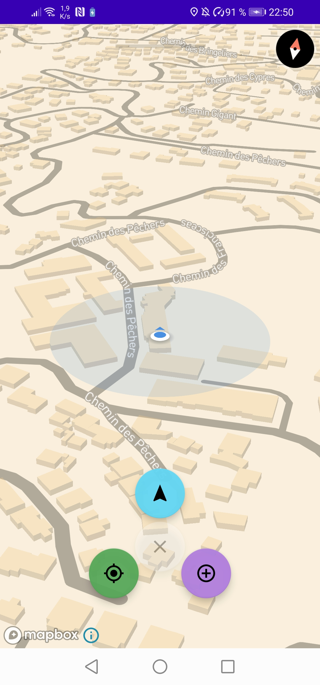
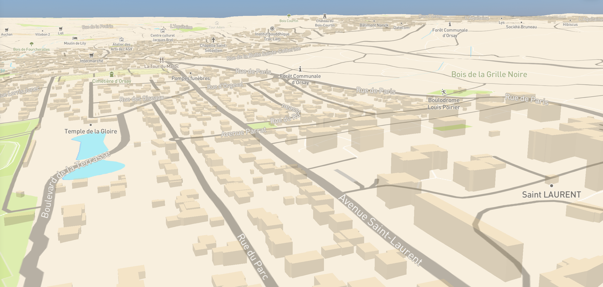

# PubScanner

 

Le projet PubScanner a pour objectif d'aider les entreprises à se faire connaître par le biais de publicités temporaires.
Tout en permettant aux différentes communes d'être plus attractive grâce aux personnes qui s'y rendront grâce au concept de cette application.
Les utilisateurs pourront faire la chasse aux bonnes affaires tout en explorant les différentes communes de la région.

# Aperçu & Carte personnalisée (MapBox)

  

# Installation sur android
Se rendre dans le TAG : PubScanner APK -> Télécharger le ficher APK -> Installer sur le téléphone 

# Utilisation
Scan : long click sur l'écran.

Fermeture du formulaire : double click.

Permissions : autoriser la localisation et l'utilisation de l'appareil photo

